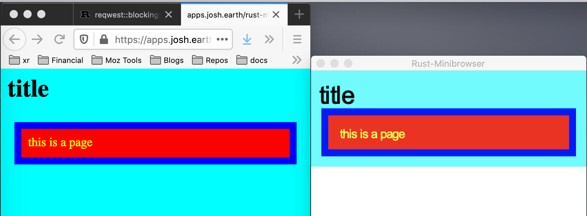

# rust-minibrowser
mini-browser written in rust

The point of this project is to prove we can build a web-browser in just a few thousand lines of code, provided
we don't care about:

* speed
* implementing the full specs
* error handling
* javascript

currently the projct is less than 2000 lines of Rust code, and at least a third of the code is unit tests.

The other point of this project is to teach myself Rust.

So far the mini-browser can:

* parse CSS files (not the full spec yet)
* parse HTML files (not the full spec yet)
* layout a page with simple block and simple inline layout
* render with the properties for display, color, background-color, border-color, padding, margin, border-width.
* load HTML and CSS over the network or from a local file
* load and render images (JPG and PNG)

It does not yet, but will soon:
* handle nested inline styles (spans, em, strong, etc.)
* handle clicking on links (a) 

This project is derived from the excellent [Rust browser tutorial](https://limpet.net/mbrubeck/2014/08/08/toy-layout-engine-1.html) by Matt Brubeck. The original only got as far as block layout with backgrounds. I've added inline layout with text drawing. 

# How it works

This project is a simplified version of what goes on in real browsers.

* First it fetches and downloads the HTML page
* parse the HTML page into a tree of `Node` objects.
* next it scans the HTML page for any `style` elements which would contain CSS
* it parses the CSS into a `Stylesheet` object
* with the Node tree and Stylesheet in hand, it processes them in the style module to produce a style tree. This does all of the matching of nodes to the styles in the stylesheet.
* next the styled tree is processed to produce a layout tree.
* call layout on the layout tree to produce a render tree
* draw the render tree on the screen

# LOC & dependencies

The source is currently 2300 lines, which is mostly Rust code. About a third of that is unit tests.  While the app written from scratch it does have some third party dependencies.

* raqote for drawing rectangles and text
* font-kit for loading and rendering fonts
* minifb for opening an window and getting mouse and keyboard input from the native OS
* serde_json for parsing JSON config files
* pom: parser lib used to write the CSS & HTML parsers
* reqwest: for making network requests to HTTP servers
* image: for parsing JPG and PNG images

